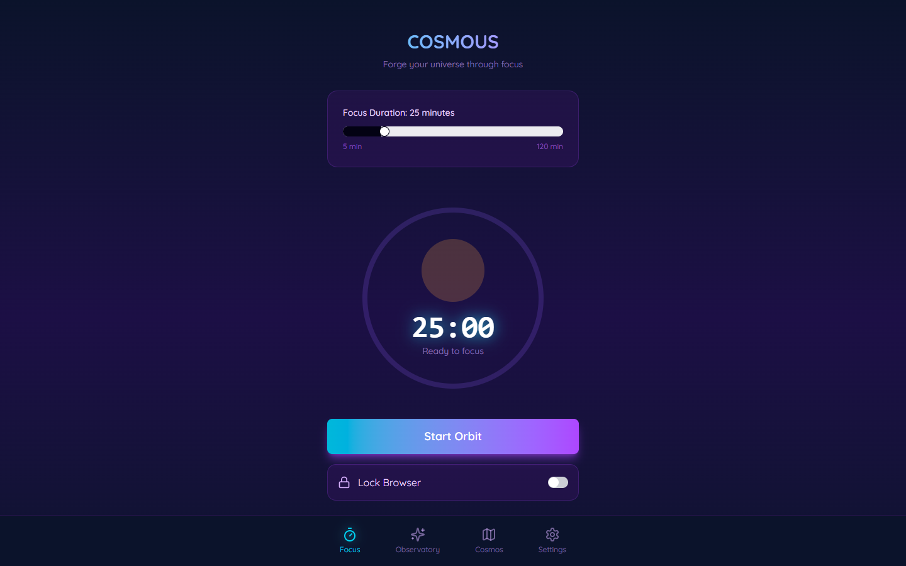
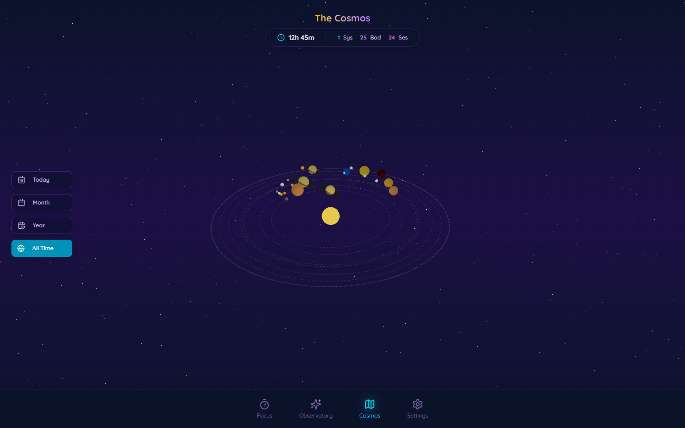

# COSMOUS 🌌

O objetivo do COSMOUS é transformar a sua produtividade em uma experiência literal de construção de universos. Através desse software focado na gamificação da concentração, cada momento de trabalho e foco permite a criação e descoberta de novos planetas, novas estrelas e a modelagem do seu próprio universo gerado de forma autônoma.

## Demonstração Visual

Aqui está uma visão completa do software em funcionamento:

### Interface do Cronômetro
A interface principal de foco. Prepare-se para imergir!


### O Seu Universo e Galáxia
Visão do progresso acumulado na forja interestelar! A simulação gera corpos celestes de acordo com as suas sessões e constrói dinamicamente esse horizonte 3D no navegador:


## Instalação (Apenas Interface)

Para rodar o front-end na sua máquina, certifique-se de que possui o Node instalado e execute:

```bash
npm install
npm run dev
```

*Nota: Para gerar progresso real a aplicação exige o modo full-stack (que está no repositório pai) já que ele manipula e salva a persistência temporal de foco real para as criações do universo.*
